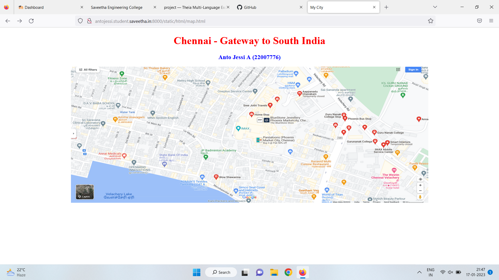

# Places Around Me
## AIM:
To develop a website to display details about the places around my house.

## Design Steps:

### Step 1:
Clone the repository into Theia IDE.

### Step 2:
Create a new Django project

### Step 3:
Write the needed HTML code.

### Step 4:
Run the Django server and execute the files.

## Code:
```
map.html
<!DOCTYPE html>
<html lang="en">
<head>
<title>My City</title>
</head>
<body>
<h1 align="center">
<font color="red"><b>Chennai - Gateway to South India</b></font>
</h1>
<h3 align="center">
<font color="blue"><b>Anto Jessi A (22007776)</b></font>
</h3>
<center>

<map name="MyCity">
<area shape="circle" coords="190,50,20" href="/static/html/mall.html" title="Palladium Shopping Mall">
<area shape="rectangle" coords="230,30,260,60" href="/static/html/icl.html" title="ICL Cricket Ground">
<area shape="circle" coords="400,350,50" href="/static/html/imax.html" title="Phoenix Market City">
<area shape="circle" coords="400,200,75" href="/static/html/bus.html" title="Velachery Bus Stand">
<area shape="rectangle" coords="490,150,870,320" href="/static/html/jp.html" title="JP Badminton Academy">
</map>
</center>
</body>
</html>

bus.html
<!DOCTYPE html>
<html lang="en">
<head>
<title>Bus Stand</title>
</head>
<body bgcolor="cyan">
<h1 align="center">
<font color="red"><b>Chennai - Gateway to South India</b></font>
</h1>
<h3 align="center">
<font color="blue"><b>Velachery Bus Stand</b></font>
</h3>
<hr size="3" color="red">
<p align="justify">
<font face="Courier New" size="5">
<b>
Chennai, formerly known as Madras, is the capital city of Tamil Nadu, the southernmost Indian state. It is the state's largest city in area and population.Chennai is also known as "Gateway to South India" because it is situated in the north-eastern part of Tamil Nadu. Ancient temples, vibrant arts, natural wonders and a bustling culinary scene make Chennai , one of the most popular tourist destinations in the southern fringes of the country.
</b>
</font>
</p>
</body>
</html>

jp.html
<!DOCTYPE html>
<html lang="en">
<head>
<title>JP Badminton Academy</title>
</head>
<body bgcolor="yellow">
<h1 align="center">
<font color="red"><b>Chennai - Gateway to South India</b></font>
</h1>
<h3 align="center">
<font color="blue"><b>JP Badminton Court</b></font>
</h3>
<hr size="3" color="red">
<p align="justify">
<font face="Tahoma" size="5">
Jp Sports Academy in Chennai is one of the leading businesses in the indoor Badminton Courts. Also known for Badminton Courts, Badminton classes, Sports Classes and much more.Sedentary lifestyle and bad eating habits make it necessary to indulge in some kind of physical activity . Playing Badminton can help strengthen the heart muscles and limit the risk of blood vessels clogging.
</font>
</p>
</body>
</html>

icl.html
<!DOCTYPE html>
<html lang="en">
<head>
<title>ICL Cricket Ground</title>
</head>
<body bgcolor="pink">
<h1 align="center">
<font color="red"><b>Chennai - Gateway to South India</b></font>
</h1>
<h3 align="center">
<font color="blue"><b>ICL Cricket Ground</b></font>
</h3>
<hr size="3" color="red">
<p align="justify">
<font face="Arial" size="5">
<b>
ICL GURU NANAK Cricket Ground is a cricket ground in Velachery, Chennai. Also known as India Cement Limited Guru Nanak College Ground for sponsorship reasons, it is named after the Sikh Guru Nanak.The college ground was founded in 1971 on the 500th anniversary of Guru Nanak.
The ground has been used for first class cricket since 1978. It has hosted Ranji Trophy matches since 1996 for Tamil Nadu and a Women's One Day International in 2002. It is one of the venues for hosting warm-up matches for the 2016 ICC Women's World Twenty20.
</b>
</font>
</p>
</body>
</html>

mall.html
<!DOCTYPE html>
<html lang="en">
<head>
<title>Palladium Shopping Mall</title>
</head>
<body bgcolor="lime">
<h1 align="center">
<font color="red"><b>Chennai - Gateway to South India</b></font>
</h1>
<h3 align="center">
<font color="blue"><b>Palladium Shopping Mall</b></font>
</h3>
<hr size="3" color="red">
<p align="justify">
<font face="Georgia" size="5">
Palladium is a name synonymous with premium luxury retail. It’s not just a one-stop, high-end destination for shopping, it’s a lifestyle.With its unique architecture, the Palladium complex stands out as a design statement in the Chennai landscape.Palladium also provides for special services such as a 
<ul>
<li>concierge desk</li>
<li> fine dining restaurants</li>
<li>salons</li>
<li>WiFi and valet parking for all visitors.</li>
</ul>
</font>
</p>
</body>
</html>

imax.html
<!DOCTYPE html>
<html lang="en">
<head>
<title>IMAX</title>
</head>
<body bgcolor="orange">
<h1 align="center">
<font color="red"><b>Chennai - Gateway to South India</b></font>
</h1>
<h3 align="center">
<font color="blue"><b>IMAX</b></font>
</h3>
<hr size="3" color="red">
<p align="justify">
<font face="Georgia" size="5">
IMAX Movie theater chain known for presenting 3D films on a giant screen, including blockbusters.
It's technical specifications are
<ol type="1">
<li>Spherical lenses</ake is li>
<li>70 mm film</li>
<li>fisheye lenses.</li>
</ol>
</font>
</p>
</body>
</html>
```

## Output:



## HTML Validator


## Result:
The program for implementing image map is executed successfully